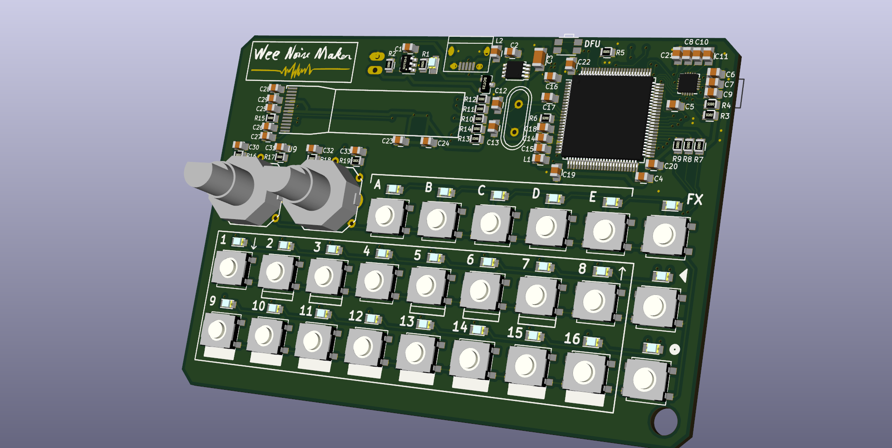

 
# Blog

## 04: From the first board to Wee Noise Maker Mk-I rev-C

### Wee Noise Maker Discovery rev-A

As I said in the first post, I rushed to produce a first PCB to try 
my new idea as fast as possible. The first board was just a matrix 
of buttons and LED, it worked OK and gave me the motivation to continue
this project.

### Wee Noise Maker Mk-I rev-A

For the second board - named Wee Noise Make Mk-I - I decided to make 
a stand alone project with the MCU, audio codec, OLED screen, power 
supply, battery charging, SD card, etc..

When the Mk-I rev-A PCB arrived from SeeedStudio, the first thing I
noticed is that I completely screwed up two footprints, the encoders
and the voltage regulator… To be honest this is really unacceptable.
I should always print the PCB to scale on a piece of paper and check
the footprints before sending the design for production. The encoders
I could still plug them in by bending the pins but the voltage 
regulator was completely off (TSOP vs HTSOP).

Anyway, I started by soldering my first LQFP-100 package the STM32F4 - 
it is not as bad as it seems - and all the passives around it, then 
I tried to program and run it. It worked! That was great. The battery 
charging and OLED screen were also working as expected.

The last main component to solder was the SGTL5000 audio DAC, a QFN package.
I watched a few tutorial to learn how to solder this kind of package but it
seemed difficult so I wasn’t very confident.

Once it was soldered, I tried to make the MCU talk with the DAC over I2C but
got no answer. At some point I realized that my circuit was really bad. A dumb
error again, this time with decoupling capacitors… This was the second major
failure on this board, time to make a new revision.

### Wee Noise Maker Mk-I rev-B

For rev-B I got all the footprints right \o/ But the DAC was still silent :(

After a few hours debugging, inspecting the schematic and reading the 
documentation, I realized that one of the three power supply pins has to be 
at 1.8V (vs 3.3V for the others), it meant I had to add an extra voltage 
regulator. Let’s go for rev-C...

### Wee Noise Maker Mk-I rev-C

I received the rev-C board early June and soldered all the components right
away. Once again everything was working except the audio DAC. The chip wasn’t
responding to I2C messages.

This time the error was not really in the hardware design. I found in the 
documentation that the SGTL5000 needs an external clock to start working. 
This external clock is actually the master clock (MCLK) of the I2S protocol, 
so I have to send I2S data before being able to talk with the DAC. Once I 
figured this, it took no time to have Wee Noise Maker produce its first sounds!

Now that I can play sound, there’s still two features I need to check: sound
input and SD card. Once I validate the hardware for those to I will start to
focus on the software. 

## 03: Standalone board?

For the second version of the board, my first intent was to do another STM32F4
DISCO daughter board. But then I thought, why not design a standalone board?

Routing and soldering a LQFN100 package seems quite a challenge for me because
I never designed such a complex board and I basically didn't have any
experience with surface mount components. There's also a lot more
components: power supply, audio DAC, decoupling, oscillator, etc.

But who doesn't like a good challenge? So I decided to do the standalone board
and I also to add a battery charging circuit, an SD card and a small OLED
screen for good measure :)

For the audio DAC, I tried to find a component with a friendly package that
doesn't require hot air soldering (like TSOP, LQFN). I found a couple
of those but they don't have headphone amplifier or input ADC so In the
end I went for the SGTL5000 (QFN16), also because it's used on the
Teensy audio board so I have a reference design to start from.

## 02: Switching to Kicad

I designed 4 PCBs before this project, two iterations of a guitar amplifier and
two ATtiny boards for PCB design introduction lessons and also a demo at work.

Those 4 boards I designed with Eagle CAD. Why? I'm not even sure. It
was free (as in beer), available on my platform (Linux) and there was a lot of
tutorials and other resources on the web.

For this project I switched to Kicad. Thanks to Chris Gammell's ["Getting to
blinky 4.0"]
(https://contextualelectronics.com/learning/getting-to-blinky-4-0/) video
series, I was able - in a couple hours - to do as much with Kicad as I was able
to do with Eagle.

Before switching to Kicad, my main concern was the lack of autorouter, but I
quickly realized that up to a certain complexity there's no way around manual
routing. The most difficult part of board layout is to find the right place and
orientation for the components, Eagle's autorouter is not doing that for you.
Also the [push-and-shove](https://www.youtube.com/watch?v=zxHDAHpR5Ls) routing
feature of Kicad really helps.

To this day, my only problem with Kicad is the workflow produced by the
disconnect between the schematics and the PCB layout. I think I understand the
rationale behind it and It's actually very nice to be able to put a resistor in
the schematic without having to make a decision on the package right away. But
in my own experience, designing a board is an iterative process. I go back and
forth between the PCB and the schematic usually to change net names or connect
a button to that MCU pin rather and this one. Having to click 4 or 5 times just
to do that is really not practical. I heard this will change in version 5,
let's see.

Big bonus: 3D render out of the box!

## 01: Quick! Make a PCB!

A few weeks ago I brought a fantastic piece of electronic, the Pocket Operator
Arcade (PO-20) from Teenage Engineering. It's a software synthesizer on
small PCB with a grid of push buttons and LEDs, two potentiometers and a custom
[LCD
screen](https://macprovid.vo.llnwd.net/o43/hub/media/1001/12143/3338900.jpg)
like you would find on a Game & Watch.

Here's a short video that demonstrates the
[features of the PO-20](www.youtube.com/watch?v=W5PvXQq3DVQ).

After playing a [little bit with
it](https://www.youtube.com/watch?v=CN5plqgpwa4), I had a feeling you may know
if you are reading this: I want to make my own! When I start a project like
this one, I jump right in and design a first PCB very quickly while I'm
still in the excitement of this brand new idea. The PCB is of course not very
good (two bodge wires this time) but now I can't go back :)

The first board was designed as daughter board for the STM32F4 DISCO. It has a
powerful microcontroller (Cortex-M4F ~160 Mhz) and an audio DAC with headphone
output, so the "only" thing left to do is the user interface
(buttons and LEDs).

With this board I was able to start working on the software, play with
multiplexed LED and buttons, start a first version of the state machine and get
some sounds out.

But it's time for the second design. I'm a software engineer so
the electronic part of this project is the most challenging and interesting for
me.
